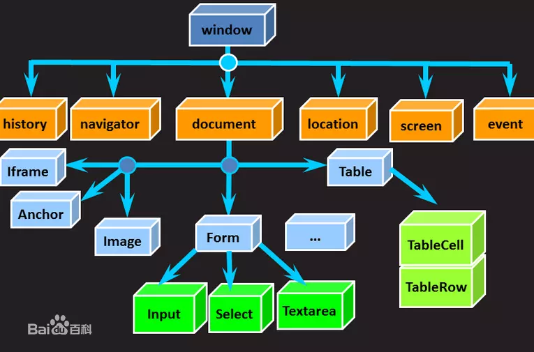
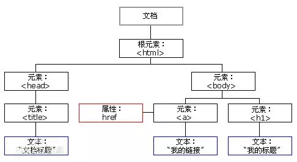

&nbsp;&nbsp;&nbsp;&nbsp;在Java这一支的Web开发领域中，谈及前端开发必然离不开JavaScript、DOM和BOM，它们是JavaWeb开发领域中的基石，所以也必然是要掌握和精通的。JavaScript自然不用说，DOM（Document Object Model——文档对象模型）对象可以操纵着所有的HTML标签元素，BOM（Browser Object Model——浏览器对象模型）对象你可以通过它获取与浏览器有关的诸多有用信息。

### BOM

&nbsp;&nbsp;&nbsp;&nbsp;BOM（Browser Object Model）即浏览器对象模型。W3C对BOM的定义尚无正式标准。由于现代浏览器几乎已经实现了 JavaScript 交互性方面的相同方法和属性，因此常被认为是 BOM 的方法和属性。    

既然是与浏览器交互的那么我们都能做什么呢？如：弹出/关闭新的浏览器窗口,检测浏览器类型和版本，操作DOM，获取浏览器的窗口的尺寸信息、地理位置信息、当前页面的URL地址等。要实现上述功能还需要借助BOM中的具体的对象属性方法等。   

BOM中的对象：
- **window 对象：** window 对象表示浏览器中的内容。所有JavaScript 全局对象、函数以及变量均自动成为 window 对象的成员。 
>open("url"，“_black或_self”，“新窗口的大小”）
>close()  关闭当前的网页
>scrollTo() 内容滚动到指定的坐标
>setTimeout(fn，delaytime) 只执行一次
>setInterval(fn，delaytime) 定时重复执行
>clearTimeout(定时器名称) 清除定时器 
>clearInterval（定时器名称)
>alert('提示信息')  
>confirm("确认信息")
>prompt("弹出输入框") 

- **screen 对象：** 包含有关用户屏幕的信息。 
>height: 获取整个屏幕的高。
>width : 获取整个屏幕的宽。
>availHeight: 整个屏幕的高减去系统部件的高。
>availWidth : 整个屏幕的宽减去系统部件的宽。

- **Location 对象：** 用于获得当前页面的地址 (URL)，并把浏览器重定向到新的页面。 
>location.herf = url
>port 返回URL中的指定的端口号，如URL中不包含端口号返回空字符串
>portocol 返回页面使用的协议。 http:或https:
>host 返回服务器名称和端口号。
>search 返回？号后面的所有值。
>pathname 返回目录和文件名。
>hash 返回#号后面的字符串，不包含散列，则返回空字符串。

- **Navigator 对象：** 包含有关访问者浏览器的信息。 
>plugins[] -浏览器已经安装的插件
>userAgent -客户机 user-agent 头部的值
>userLanguage -OS 的自然语言设置

- **cookie 对象：** 通过存储于访问者的计算机中的变量来识别用户。 
>document.cookie="popped=yes"

- **History 对象：** 浏览器的历史记录。
>history.back() 返回上一页。
>history.forward() 返回下一页。
>history.go(1) -1表示上一页，1表示下一页。 

 

上图是BOM对象的结构图     

只有JavaScript代码在浏览器环境中执行的时候window对象才会作为JavaScript中全局占位符Global对象的实例对象使用(鸠占鹊巢)，HTML DOM 的 document 也是 window 对象的属性之一, 在调用全局对象属性和方法的时候可以省略window。

```javascript
window.document.getElementById("id");
// 获取当前浏览器的信息
window.navigator.userAgent.toLowerCase().match(/chrome\/([\d.]+)/)[0];  
// or
navigator.userAgent.toLowerCase().match(/chrome\/([\d.]+)/)[0]; 
// 屏幕宽高
document.write('Width: ' + window.innerWidth + " Height: " + window.innerHeight); 
// 类型转换
alert(window.parseInt("12335")); 
// 计时器
window.setTimeout(()=>{
  alert(new Date()); 
}, 3000);
```

还有window.open()、window.close()、window.resizeTo()等，不细说了。

### HTML DOM

&nbsp;&nbsp;&nbsp;&nbsp;MDN的概述：DOM（Document Object Model——文档对象模型）是用来呈现以及与任意 HTML 或 XML文档交互的API。DOM 是载入到浏览器中的文档模型，以节点树的形式来表现文档，每个节点代表文档的构成部分（例如:页面元素、字符串或注释等等）。DOM (文档对象模型) 是HTML和XML文档的编程接口。它提供了对文档的结构化的表述，并定义了一种方式可以使从程序中对该结构进行访问，从而改变文档的结构，样式和内容。DOM 将文档解析为一个由节点和对象（包含属性和方法的对象）组成的结构集合。简言之，它会将web页面和脚本或程序语言连接起来。   

DOM 是万维网上使用最为广泛的API之一，因为它允许运行在浏览器中的代码访问文件中的节点并与之交互。节点可以被创建，移动或修改。事件监听器可以被添加到节点上并在给定事件发生时触发。现在， WHATWG维护DOM现存标准。



上图是 Html 中的 DOM 元素结构图，和 xml 一样Html也是树型结构。在实际开发中最多的问题还是各大浏览器平台、webAPI新旧版本的兼容性问题，无论是标签属性，CSS样式还是DOM事件还是各大浏览器的API都是需要注意的。 

#### DOM对象

&nbsp;&nbsp;&nbsp;&nbsp;在html中有很多DOM对象如：Document、Element 、Attribute、Event、Anchor、Body、Button 等这些都是HTML中的DOM对象，HTML中一个标签对应一个DOM标签对象如： Anchor对应`<a>`标签、Body对应`<body>`标签等，这里主要关注Document、Element 、Attribute、Event这几个DOM对象。  
&nbsp;&nbsp;&nbsp;&nbsp;另外：原生DOM对象和jQuery中的DOM对象略有不同，主要的区别还是体现在jQuery的对象处理上，因为jQuery是在原生的基础上又进行了抽象和封装处理，就像它得名字`jQuery`一样，` js query ` 你需要从它得类数组对象中查找你要用得对象，现在也就只记得个`$`和`$()`了... 😂😂 彻底忘光了哎，现在是HTML5、前端工程化、组件化的时代，用到jQuery的话再补吧。  
言归正传，接下来看看几个经常打交道的DOM对象。 
- **document 对象：**  document 对象是文档本身的根节点。每个载入浏览器的 HTML 文档都会成为 document 对象。使我们可以从脚本中对 HTML 页面中的所有元素进行访问。Document 对象也是 Window 对象的一部分，可通过 window.document/document 对 HTML 文档进行操作。  
- **element 对象：**  Element 继承了通用的 Node 接口，Element可以拥有类型为元素节点、文本节点、注释节点的子节点。在 DOM 中，每个部分都是节点，文档本身也是文档节点，所有 HTML 元素是元素节点，所有 HTML 属性是属性节点。 
- **attribute 对象：**  attribute 对象表示 HTML 节点的属性。 
- **event 对象：**  代表事件的状态，事件通常与函数结合使用，函数不会在事件发生前被执行！ 

DOM操作常用的接口：
- **document.getElementById(id)**  返回指定 id 的元素节点对象。
- **document.getElementsByTagName(name)**  返回指定 name 的元素节点对象数组。
- **document.createElement(name)**  根节点中创建子节点。
- **parentNode.appendChild(node)**  父元素节点添加子节点。
- **element.innerHTML** 修改元素的内容。
- **element.style.property**  修改元素的样式。
- **element.setAttribute(attrName，value)**  设置指定元素的属性值。
- **element.getAttribute(attrName)**  获取元素属性的当前值。
- **element.addEventListener(type，listener, useCapture)** 为元素注册监听器事件。
- **window.onload** 窗口load事件。
- **window.scrollTo()** 滚动到文档中的一组特定坐标。

更多的接口方法、对象属性还是多查查w3c或者MDN的帮助文档。

#### DOM Event

在W3C标准事件模型中事件处理过程分三个阶段：捕获阶段、目标阶段和气泡阶段。
- **捕获阶段：**  事件将沿着DOM树逐级向下传播，直至目标节点。
- **目标阶段：**  浏览器在查找到已经指定给目标事件的事件监听器之后，就会运行该事件监听器。目标节点就是触发事件的DOM节点。
- **目标阶段：**  事件将沿着DOM树逐级向上传播至document节点，在此过程中。浏览器都将检测那些不是捕捉事件监听器的事件监听器，并执行它们。

DOM Event事件的绑定一般有以下几种方式：   

1、HTML标签内属性：

```javascript
<div id="eve-3" onclick="console.log('Click eve-3')">Clicke!</div> 
```
这种方式行为与表现未分离而且绑定事件单一，功能繁杂起来，容易出现加载时差问题，也不容易维护还比较容易被覆盖掉。

2、DOM 标签对象属性：

```javascript
<div id="eve-1">
  <div id="eve-2">
    <div id="eve-3" >Clicke!</div> 
  </div>
</div>
<script type="text/javascript">
  document.getElementById("eve-3").onclick = function(e){
      console.log('eve-3')
  }
  document.getElementById("eve-2").onclick = function(e){
      console.log('eve-2')
  }
  document.getElementById("eve-1").onclick = function(e){
      // e.cancelBubble=true;
      // event.stopPropagation()；
      console.log('eve-1')
  }
</script>
---------- console -----------
eve-3
eve-2
eve-1
```
这种方式比第一种有所改善行为与表现分离，事件绑定依旧比较单一。从输出结果来看`eve-3`的click事件传播顺序是`eve-3` → `eve-2` → `eve-1` 由内而外，从子节点触发逐级传播至根节点，这种模式就是`冒泡型事件处理模型(Bubbling)`， 注释掉的部分就是阻止事件冒泡了。 DOM Event处理模型的另外一种模式就是`捕获型事件处理模型(Captrue)`与冒泡型相反，它是从根节点触发逐级传播到子节点。

3、addEventListener监听器接口：
在所有支持W3C标准事件监听器的浏览器中，支持事件的对象都可以使用addEventListener接口，既支持冒泡型事件处理又支持捕获型事件处理。但是与IE11之前版本的事件监听器不同，需要使用`attachEvent`方法和`detachEvent`方法。

```javascript
<div id="eve-1">
  <div id="eve-2">
    <div id="eve-3">Clicke Me!</div> 
  </div>
</div>
<script type="text/javascript">
  document.getElementById("eve-1").addEventListener('click', ()=>{console.log("eve-1")});
  document.getElementById("eve-2").addEventListener('click', ()=>{console.log("eve-2")});
  document.getElementById("eve-3").addEventListener('click', ()=>{console.log("eve-3")});
</script>
---------- console -----------
eve-3
eve-2
eve-1
```
`addEventListener`监听器接口标准格式：target.addEventListener(type, listener, useCapture);   
useCapture默认为false使用冒泡型事件处理,为true则是捕获型事件处理；IE的事件处理和其它浏览器不同，IE可以通过调用window.event对象获取事件本身的引用和通过srcElement属性获取触发事件的目标元素，而W3C标准中则是通过事件对象的参数传递获取事件自身的引用和target属性获取目标元素；兼容IE的写法：

```javascript
...
var EventObj = {
  getEvent: (event) => {
    return event?event : window.event;
  },
  getTarget: (event) => {
    return event.target || event.srcElement;
  },
  addHandler: (element, etype, handler) => {
    if (element.addEventListener) {
      element.addEventListener(etype, handler, false);
    } else if (element.attachEvent) {
      element.attachEvent("on" + etype, handler);
    } else {
      element["on" + etype] = handler;
    }
  },
  removeHandler: (element, etype, handler) => {
    if (element.removeEventListener) {
      element.removeEventListener(etype, handler, false);
    } else if (element.detachEvent) {
      element.detachEvent("on" + etype, handler);
    } else {
      element["on" + etype] = null;
    }
  }
};
EventObj.addHandler(document.getElementById("eve-1"), 'click', ()=>{console.log("eve-1")});
EventObj.addHandler(document.getElementById("eve-2"), 'click', ()=>{console.log("eve-2")});
EventObj.addHandler(document.getElementById("eve-3"), 'click', ()=>{console.log("eve-3")});
```

#### 阻止事件的冒泡传播和默认行为

通过前面我们了解到 DOM 在处理事件时是通过 DOM 节点逐级传播进行响应的，这个传播的过程就是事件流；在此过程中 DOM 事件的传播行为就可以触发事件流中其它 DOM 节点上的事件，会产生意外的效果，所以有必要对 DOM 事件的传播行为做限制或者阻止。至于事件的默认行为是指在事件传递并处理完后会执行与该事件关联的默认动作，比如form表单提交的时候input元素的值自动被填充，复选框的默认处理，a标签的页面跳转行为等。 

#### 阻止事件的冒泡传播

- **event.cancelBubble属性：**  MDN上新版本的web标准已经废弃不在使用了，推荐使用event.stopPropagation()方法代替。
- **event.stopPropagation()方法** 阻止捕获和冒泡阶段中当前事件的进一步传播。

兼容新旧版浏览器，两种方式最好都用上。

#### 阻止事件的默认行为

- **event.returnValue属性：**  设置此属性false可防止默认操作。
- **event.preventDefault()方法：**  阻止事件的默认行为。

综合一下就是：

```javascript
var EventObj = {
  preventDefault: (event) => {
    if(event.preventDefault){
      event.preventDefault();
    } else {
      event.returnValue = false;
    }
  },
  stopPropagation: (event) => {
    if (event.stopPropagation){
      event.stopPropagation();
    } else {
      event.cancelBubble = true;
    }
  }
};
```

最后关于捕获型事件与冒泡型事件模型，DOM标准事件模型中给我们提供了两种方案，IE中仅支持冒泡型事件模型，所以冒泡型的兼容性好一些   ASDF34567890-，但是捕获型事件自然有其用处，比如在某些情况下动态处理页面元素时使某一区域内元素点击无效，这种情况下用捕获型就要比冒泡型更适合，在区域的顶级节点添加捕获型事件监听器，满足某一条件时在监听器中阻止事件的传播，使区域内点击事件无效化。冒泡型则是由子节点影响父节点与捕获型刚好相反；以上就是本小节的全部内容了。


